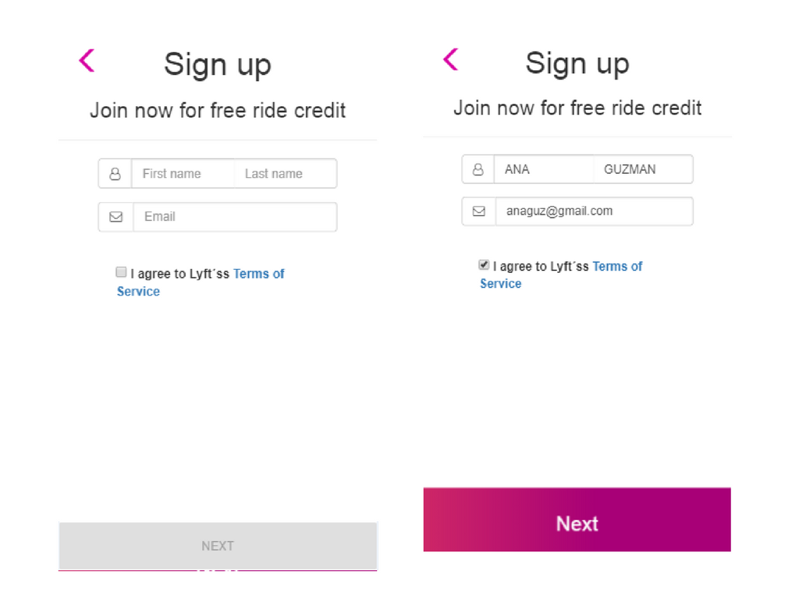

# RETOS DE CODIGO: LYFT

__Sprint 03 - unidad 03:__  
*Agiliza tu Desarrollo*

*Segundo Reto:*  
__LYFT__  *por Aylin Espichan*

_______

Como el mundo no se detiene y nosotras tampoco, este reto consiste en desarrollar una web-app donde se replique el sitio web de __Lyft__ donde nuestros usuarios puedan registrarse para hacer uso de este servicio.

La vista Inicial debe contar con:
- Un Splash con duración de 2 a 5 segundos que redirecciona a tu vista de inicio. La vista tambíen debe incluir dos botones: LOG IN y SIGN UP.

En la siguiente vista tenemos un formulario donde nuestro usuario puede escoger el país y debe ingresar su número de teléfono. El botón de NEXT debe estar deshabilitado hasta que se ingrese un número de 10 dígitos. 

Una vez ingresado el número de teléfono se habilita el botón y al dar click debe enviar una alerta con un código generado aleatoriamente (LAB-000) y redireccionar a la siguiente vista. 

En esta vista se debe ingresar el código dado anteriormente y una vez hecho esto se habilita el botón que redirecciona a nuestro usuario a la vista donde ingresa sus datos. (Puede tener la opción de enviar otro código.) 

Para ingresar sus datos necesitamos un formulario que le pida su nombre, apellido y correo electrónico. Deberá también tener un checkbox para que se acepten los términos y condiciones del servicio. 

Ya que se ha realizado lo anterior, sólo se deberá mostrar una vista al usuario que le indique que ha concluido con el registro exitosamente. 

## Herramientas Utilizadas:
  * HTML
  * CSS
  * JQUERY
  * BOOTSTRAP

### Formula para generar el codigo de verificación:

Utilice dos propiedades: Math.Floor & Math.Random

~~~
 Math.floor(Math.random() * 800) + 100;
~~~
